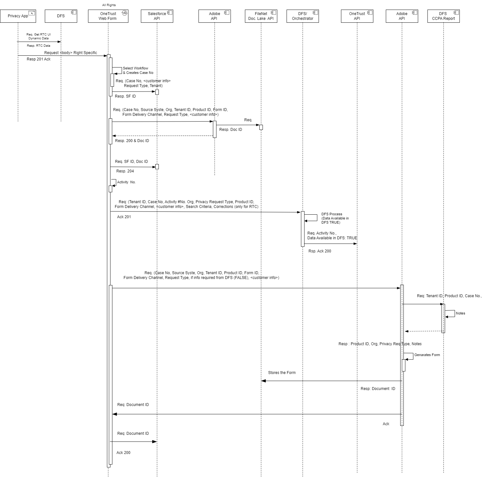

## Table of Contents

[<b>1 Scope</b>](#1-scope)

[<b>2 Data Privacy Request Intake Channels</b>](#2-data-privacy-request-intake-channels)

&nbsp;&nbsp;[2.1 Web Channels](#21-web-channels)

&nbsp;&nbsp;[2.2 Toll Free Telephone Numbers](#22-toll-free-telephone-numbers)

[<b>3 Data Privacy UI Design</b>](#3-data-privacy-ui-design)

&nbsp;&nbsp;[3.1 Design Constraints](#31-design-constraints)

&nbsp;&nbsp;[3.2 Privacy Application Design](#32-privacy-application-design)

[<b>4 Data Privacy Backend Processing</b>](#4-data-privacy-backend-processing)

&nbsp;&nbsp;[4.1 High Level Design](#41-high-level-design)

&nbsp;&nbsp;[4.2 Background Information](#42-background-information)

&nbsp;&nbsp;[4.3 OneTrust Workflow Interactions](#43-onetrust-workflow-interactions)

&nbsp;&nbsp;[4.4 Fulfillment Orchestrator](#44-fulfillment-orchestrator)

[<b>5 References</b>](#5-references)

[<b>6 Glossary</b>](#6-glossary)

 

## 1 Scope

The scope of this *California Privacy Rights Act (CPRA)* implementation covers the consumers’ *Right to Know (RTK)*, *Right to Correct (RTC)*, *Right to Delete (RTD)*, and *Right to Appeal (RTA)* for VPP, KINTO, Employees, Dealers, and Vendors.

## 2 Data Privacy Request Intake Channels

### 2.1 Web Channels

Figure 1 depicts the Web channels that consumers can use to submit their Data Privacy Requests (DPR).

*Figure 1: Web Channels for Submitting Data Privacy Request*

*Toyota Motor Insurance Services (TMIS)*, *Mazda Protection Plan (MPP)*, and *Continuous Customer Care (CCC)* consumers can submit the DPRs following <Data Privacy Request> link from their respective financial websites. The link renders the *PrivacyApp* response that includes the Web Form for submitting the DPR. The completed forms are submitted to the *OneTrust Data Fulfillment Service (DFS)* for fulfillment.

The *Kinto* consumers submit the DPRs via the *CCPA* website. The requests are forwarded to Zendesk service for manual fulfillment by the Privacy Compliance team. At the same time, the team manually creates corresponding requests in *OneTrust* (utilizing the *Kinto OneTrust Web Form*) for tracking and reporting purposes.

### 2.2 Toll Free Telephone Numbers

The CPRA implementation offers two toll-free telephone numbers in support of DPRs, one for *TMIS*, *MPP*, and *CCC* consumers and another for *Kinto* consumers (see Figure 2).

*Figure 2: Telephony Channels*

In both cases, the requests are fulfilled manually by the Privacy Compliance team using the appropriate *OneTrust Web Form*.

## 3 Data Privacy UI Design

### 3.1 Design Constraints

The following design constraints are imposed on PrivacyApp:
 1. Support for One End Point – Multiple Brands/Tenants (TMIS, MPP, CCC, additional future brands) pattern,
 2. Ability to do a dynamic rendering of the privacy function from `UIWidget` at runtime,
 3. Ability to do dynamic fetching of `UIWidget` operational data.

### 3.2 Privacy Application Design

The Privacy Application components are shown in Figure 3.

*Figure 3: Privacy Application Components*

The Application is composed of two main components:

1.	Host Page HTML document with additional tags as follows:
  
    - DOM Container `
` tag with a unique id to mark the spot where we want to include the React `UIWidget` content,
    - `<script>` tags to load the React `UIWidget`.

2.	Brand/Tenant specific React `UIWidget` that supports the core privacy functionality (Privacy Web Form in this instance).
Access to the Brand/Tenant specific UIWidgets cannot be direct – consider constraints 1 and 2.

To address the constraints, we introduced a Load Balancer which in addition to its load balancing functions injects the Brand/Tenant ID in the HTTP Request Header based on the Host Page Brand.

The requests are forwarded to the API Gateway which in addition to its typical functions uses the Tenant ID data from the HTTP Header to reverse-proxy the service request to the Tenant-specific `UIWidget`.

The PrivacyApp design is further elaborated in Reference [2].

## 4 Data Privacy Backend Processing

### 4.1 High Level Design

Figure 4 shows a high-level design of the CPRA backend processing. 

*Figure 4: CPRA Backend Processing - High-Level Design*

### 4.2 Background Information

Several comments are in order:

1. All Toyota VPP insurance agreements (for Toyota as well as non-Toyota vehicles) are managed using Insurance Host (IH),
2. MPP insurance services are sold via StoneEagle, a third-party vendor,
3. The Product Ids in the scope of this implementation:

    - **TMIS** – Toyota and Lexus insurance products offered to Toyota and Lexus customers as well as to CCC customers that own non-Toyota vehicle,
    - **MPP** – Mazda insurance products offered to Mazda customers,
    - **TMCC** – Toyota credit products offered to Dealers, Employees, and Vendors.
4. Repositories that support the products in the scope of this implementation:
    - **IH** – supports all TMIS insurance agreements for Toyota, Lexus, and CCC customers,
    - **UCM** – legacy customer data repository for TMIS (Toyota, Lexus, and CCC) customers,
    - **UPM** – master customer data repository for TMIS and MPP customers,
    - **StoneEagle**: supports MPP insurance agreements for Mazda customers,
    - **TMCC Repos**: support TMCC credit agreements for Dealers, Employees, and Vendors.

5. Existing data synchronization processes:
    - **IH to UCM** – ***bidirectional*** daily synchronization of TMIS and CCC customer data based on Tibco Processes (File Adapter, and XML to COM & COM to UCM transformers),
    - **StoneEagle to UPM**: ***unidirectional*** daily synchronization of the full MPP data set, leaving a possibility of overwriting the UPM data changed during a day with stale StoneEagle data during the nightly updates – the design needs to prevent overwriting.

### 4.3 OneTrust Workflow Interactions

The following notes are relevant to the interactions documented in Figure 5:
- **Orgs**: Toyota Motor Insurance Services, Mazda Protection Products, Continuous Customer Care.
- **Tenant ID**: T001 (TMIS, CCC); T002 (MFS).
- **Form Delivery Channels**:  (email, print central).
- **Request Type**: disclosure, delete.
- **Activity #** : disclosure, delete.
- **Privacy Request Type**: RTKnow, RTCorrect.
- **Search Criteria (for RTK, RTC)**: for TMIS & CCC: One of (Application No, Agreement No), VIN No., for MPP: VIN No (last 8 digits).
- **Corrections (RTC only)**: Name, Address, Phone #.
- **Customer Ack Form ID (Added by Adobe)**: (TMIS, MPP, CCC)

*Figure 5: OneTrust Interaction Diagram*

### 4.4 Fulfillment Orchestrator

Figure 6 shows the main components involved in automated fulfillment of the privacy requests. The automated fulfillment is available for TMIS insurance consumers.

*Figure 6: Data Fulfillment Orchestrator- Components Interactions*

## 5 References:
1. Privacy Plus Design: https://github.tfs.toyota.com/harpo/privacy-plus.design
2. Privacy UI Integration: https://github.tfs.toyota.com/harpo/privacy.ui-integration
3. DFS CDAR Service: https://github.tfs.toyota.com/harpo/dfs.cdar-service
4. Data Fulfillment Service: https://github.tfs.toyota.com/harpo/project.data-fulfillment-service
5. CCPA Design Artifacts: https://github.tfs.toyota.com/harpo/CCPA_Design_Artifacts

## 6 Glossary
- **CCPA** : California Consumer Privacy Act
- **CCC** : Continuous Customer Care
- **CDAR** : Customer/Consumer Data Access Request (part of DFS)
- **CDPA** : Virginia’s Consumer Data Protection Act
- **CPA** : Colorado Privacy Act
- **CPRA** : California Privacy Rights Act
- **DFS** : Data Fulfillment Service
- **DPO** : Data Provider Orchestrator
- **DPR** : Data Privacy Request
- **DSAR** : Data Subject Access Requests (part of OneTrust)
- **DSR** : Data Subject Requests (part of OneTrust)
- **IH** : Insurance Host
- **JMS** : Java Message Service
- **PI** : Personal Information
- **RTA**: Right to Appeal
- **RTC** : Right to Correct
- **RTC** : Right to Correct
- **RTD** : Right to Delete
- **RTK** : Right to Know
- **TMCC** : Toyota Motor Credit Corporation
- **TMIS** : Toyota Motor Insurance Services
- **UCM** : Universal Customer Master
- **UPM** : Universal Party Master
- **VCPA** : Virginia Consumer Protection Act
- **VCPA** : Virginia Consumer Protection Act
- **VPP** : Voluntary Protection Program